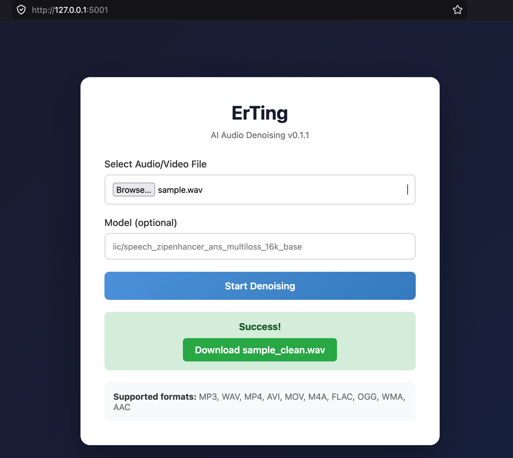
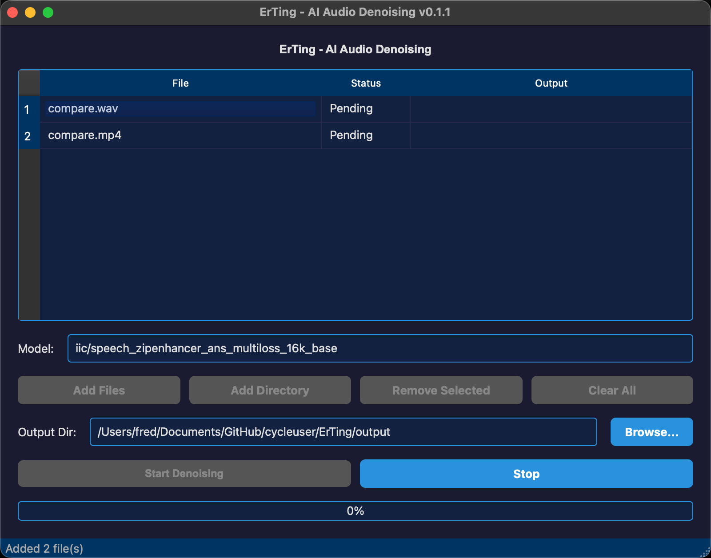

# ErTing - AI-Powered Audio/Video Denoising

A powerful, local-first audio/video denoising tool powered by AI. ErTing uses ModelScope's speech enhancement models to remove noise from your audio and video files, delivering clean, professional-quality output.

> **ErTing (耳听)** -- Hear clearly.



## Features

### Three Interfaces

- **CLI** - Full-featured command-line interface with unified flags
- **GUI** - PySide6 desktop app with batch processing, multi-file/directory import
- **Web** - Flask-based web interface for browser-based denoising

### Core Capabilities

- AI-powered noise suppression using ModelScope models
- Supports wide range of audio/video formats (MP3, WAV, MP4, AVI, MOV, M4A, FLAC, OGG, WMA, AAC)
- Automatic format conversion to 16kHz WAV for optimal processing
- Configurable output paths and model selection
- JSON output for automation workflows

## Screenshots

| GUI (Batch Processing) | Web Interface |
|:----------------------:|:-------------:|
|  |  |

## Requirements

- Python 3.10+
- [ffmpeg](https://ffmpeg.org/) (for audio format conversion)
- [ModelScope](https://modelscope.cn/) package
- 2GB+ RAM recommended for model loading

## Installation

### Method 1: Install from PyPI

```bash
pip install erting
```

### Method 2: Install from Source

```bash
git clone https://github.com/cycleuser/ErTing.git
cd ErTing
pip install -e .
```

## Quick Start

### CLI Usage

```bash
# Basic denoising
erting input.mp3

# Specify output path
erting -o output_clean.wav input.mp3

# JSON output for scripting
erting --json input.mp3

# Verbose mode
erting -v input.mp3

# Quiet mode (minimal output)
erting -q input.mp3
```

### GUI Usage

```bash
erting-gui
```

The GUI supports:
- **Add Files** - Select multiple audio/video files at once
- **Add Directory** - Import all supported audio files from a folder
- **Batch Processing** - Process all files sequentially with progress tracking
- **Auto Naming** - Output files default to `{original_name}_clean.wav`
- **Custom Output Dir** - Choose a separate directory for all outputs
- **Stop/Resume** - Cancel processing mid-batch

### Web Interface

```bash
erting-web
```

Then open [http://localhost:5001](http://localhost:5001) in your browser.

## CLI Options

```
erting [-V] [-v] [-o PATH] [--json] [-q] input [options]

Positional Arguments:
  input                  Input audio/video file path

Options:
  -V, --version         Show version and exit
  -v, --verbose         Enable verbose output
  -o, --output PATH     Output file path
  --json                Output result as JSON
  -q, --quiet           Suppress non-essential output
  --model MODEL         ModelScope model name (default: iic/speech_zipenhancer_ans_multiloss_16k_base)
```

## Python API

```python
from erting.api import denoise_audio, ToolResult

result = denoise_audio(input_path="input.mp3")
print(result.success)    # True / False
print(result.data)      # {'input_path': ..., 'output_path': ...}
print(result.metadata)  # {'version': '0.1.0', 'model': ...}
```

## Agent Integration (OpenAI Function Calling)

ErTing exposes OpenAI-compatible tools for LLM agents:

```python
from erting.tools import TOOLS, dispatch

# Pass TOOLS to the OpenAI chat completion API
response = client.chat.completions.create(
    model="gpt-4o",
    messages=messages,
    tools=TOOLS,
)

# Dispatch the tool call
result = dispatch(
    tool_call.function.name,
    tool_call.function.arguments,
)
```

## Supported Formats

| Format | Extension | Notes |
|--------|-----------|-------|
| WAV | .wav | Direct processing |
| MP3 | .mp3 | Direct processing |
| MP4 | .mp4 | Audio extracted |
| AVI | .avi | Audio extracted |
| MOV | .mov | Audio extracted |
| M4A | .m4a | Direct processing |
| FLAC | .flac | Direct processing |
| OGG | .ogg | Direct processing |
| WMA | .wma | Direct processing |
| AAC | .aac | Direct processing |

## Project Structure

```
ErTing/
├── pyproject.toml              # Package metadata & build config
├── requirements.txt            # Direct dependencies
├── README.md                   # English documentation
├── README_CN.md                # Chinese documentation
├── LICENSE                     # GPL-3.0-or-later
├── upload_pypi.sh              # Auto-version-bump PyPI upload
├── upload_pypi.bat             # Windows PyPI upload
├── erting/
│   ├── __init__.py             # Package version
│   ├── __main__.py             # python -m erting entry
│   ├── core.py                 # Audio processing engine
│   ├── cli.py                  # CLI with unified flags
│   ├── gui.py                  # PySide6 batch GUI
│   ├── web.py                  # Flask web app
│   ├── api.py                  # ToolResult API
│   ├── tools.py                # OpenAI function-calling tools
│   └── templates/
│       └── index.html           # Web UI template
├── tests/
│   ├── __init__.py
│   ├── conftest.py             # Test fixtures
│   ├── test_core.py            # Core module tests
│   ├── test_api.py              # API tests
│   ├── test_tools.py           # Tools schema tests
│   └── test_cli.py             # CLI integration tests
├── images/
│   ├── gui.png                 # GUI screenshot
│   └── web.png                 # Web interface screenshot
└── scripts/
    ├── publish.sh               # PyPI publish script
    └── publish.bat              # Windows publish script
```

## Testing

```bash
# Run all tests
python -m pytest tests/ -v

# Run specific test file
python -m pytest tests/test_api.py -v

# Run with coverage
python -m pytest tests/ --cov=erting --cov-report=term-missing
```

## Publishing to PyPI

```bash
# Linux/macOS
./upload_pypi.sh

# Windows
upload_pypi.bat
```

Or manually:

```bash
rm -rf dist/
python -m build
twine upload dist/*
```

## Development

```bash
# Install dev dependencies
pip install -e ".[dev]"

# Run tests
python -m pytest tests/ -v

# Format code
ruff format .

# Lint
ruff check .

# Type check
mypy erting/
```

## License

GPL-3.0-or-later. See [LICENSE](LICENSE) for details.
